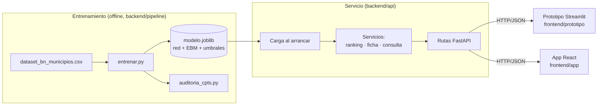
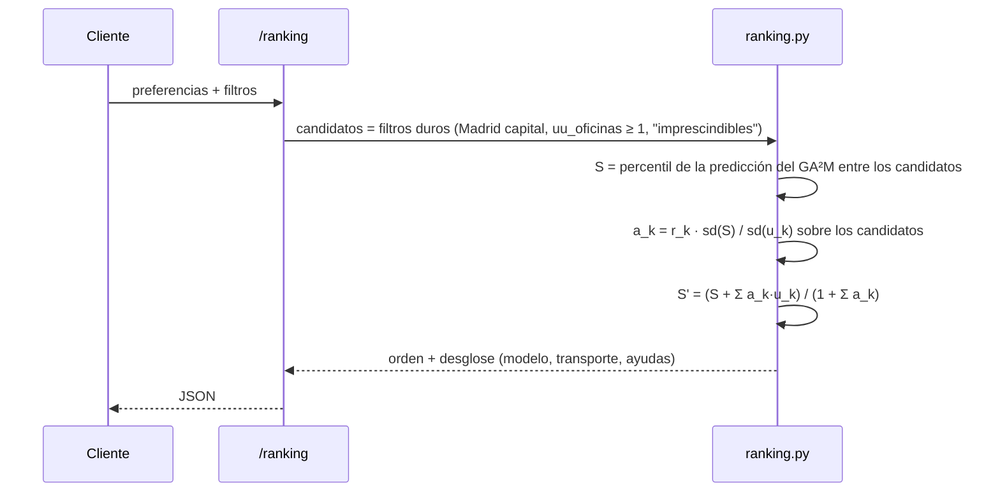

# Arquitectura del backend

Estado: **propuesta** (2026-10-08). Cubre el punto #28 de [`PENDIENTES.md`](../memoria/PENDIENTES.md) y prepara #31 (explicación por municipio) y #16 (simulador `do()`).

## 1. Objetivo y orden de trabajo

El plan de desarrollo tiene dos fases:

1. **Modelo servible y prototipo de prueba.** Exponer el modelo actual por una API y probarlo con un frontend mínimo, sin mapa, solo para ver cómo responde.
2. **Frontend definitivo.** React, MapLibre y Deck.gl (#32), sobre la misma API.

Para que la fase 2 no obligue a rehacer la fase 1, la regla de diseño es una sola: **el prototipo habla con el modelo solo a través de la API**, igual que lo hará el frontend definitivo. Así, el prototipo pone a prueba el contrato de la API y no solo el modelo.

## 2. Principios

- **Entrenar y servir son pasos distintos.** El pipeline entrena y guarda un artefacto; la API solo lo carga y consulta. La API nunca reentrena.
- **Un único modelo auditado.** La API sirve exactamente el artefacto que ha pasado `auditoria_cpts.py`, y cada respuesta lleva su versión.
- **Cada número se puede rehacer.** Las respuestas devuelven la puntuación desglosada (modelo + preferencias) y las aportaciones de cada término, no solo el total.
- **Honestidad con la incertidumbre.** La señal es débil (log-loss 1,103 frente a 1,099 de la uniforme). La API devuelve ese aviso en sus metadatos para que cualquier interfaz lo muestre.
- **Lógica sin E/S.** El paquete del modelo no lee ni escribe ficheros salvo en el módulo de artefactos; esto permite probarlo sin datos en disco.

## 3. Vista general



## 4. Estructura de carpetas

```
backend/
├── madrid179/                 # paquete con la lógica del modelo (importable, sin E/S)
│   ├── __init__.py
│   ├── config.py              # NODOS, EDGES, FILTROS, ESS, EBM_KW (hoy en red_bayesiana_viabilidad.py)
│   ├── discretizacion.py      # discretizar(): terciles sobre los 179 municipios
│   ├── red.py                 # construir_modelo(), consultas con evidencia parcial
│   ├── ga2m.py                # ajuste del EBM, predicción y aportaciones por término
│   ├── preferencias.py        # utilidades, pesos calibrados, puntuar() (hoy en pipeline/)
│   ├── ranking.py             # filtros → percentil → preferencias → orden
│   └── artefactos.py          # guardar/cargar modelo.joblib con versión y huella del dataset
├── pipeline/                  # scripts finos que llaman a madrid179
│   ├── entrenar.py            # nuevo: entrena y guarda el artefacto (sustituye a main() de red_bayesiana_viabilidad.py)
│   └── …                      # descarga, procesado, auditoría y generadores de PDF, sin cambios de función
├── api/
│   ├── main.py                # app FastAPI, carga del artefacto en el arranque (lifespan)
│   ├── esquemas.py            # modelos Pydantic de entrada y salida (el contrato)
│   ├── rutas/
│   │   ├── municipios.py
│   │   ├── ranking.py
│   │   └── consulta.py
│   └── dependencias.py        # acceso al modelo cargado
├── tests/
│   ├── test_equivalencia.py   # el paquete reproduce los CSV actuales
│   ├── test_preferencias.py
│   └── test_api.py            # TestClient sobre los endpoints
└── requirements.txt           # + fastapi, uvicorn, joblib, httpx (tests)
```

`red_bayesiana_viabilidad.py` y `preferencias.py` del pipeline pasan a importar desde `madrid179`, de modo que `auditoria_cpts.py`, `diagrama_red_bayesiana.py` y los experimentos siguen funcionando.

## 5. El artefacto del modelo

`entrenar.py` produce `data/processed/modelo.joblib` con:

| Campo | Contenido |
|---|---|
| `version` | fecha + hash corto del commit |
| `huella_dataset` | SHA-256 de `dataset_bn_municipios.csv` |
| `umbrales` | cortes de cada nodo (lo mismo que `bn_umbrales.json`) |
| `red` | `DiscreteBayesianNetwork` ajustada (BDeu, ESS = 10) |
| `ebm` | `ExplainableBoostingRegressor` ajustado |
| `municipios` | tabla de los 179: atributos continuos, estados discretos, predicción del GA²M, aportaciones por término, utilidades de preferencias, columnas de filtros |
| `validacion` | acierto y log-loss de CV-5 × 5 (media ± desviación), para devolverlos en los metadatos |

Precalcular la predicción y las aportaciones del GA²M para los 179 municipios evita cargar InterpretML en cada petición: el EBM con `outer_bags=8` es lento de ajustar, pero sus salidas por municipio son fijas.

El artefacto **no se versiona en git** (es binario y se regenera). La CI lo genera con `entrenar.py` antes de los tests.

## 6. Flujo de una petición de ranking



Detalle importante: **el percentil y los pesos se recalculan sobre los candidatos que quedan tras los filtros**. Si el usuario exige estación a ≤ 5 km, el conjunto cambia y también sd(S) y sd(u). Por eso el artefacto guarda la predicción bruta del GA²M y no la puntuación final de `bn_ranking_municipios.csv`.

## 7. Contrato de la API (v1)

Prefijo `/api/v1`. JSON en UTF-8. Los municipios se identifican siempre por `ine5` (texto de 5 dígitos).

### `GET /meta`
Versión del modelo, huella del dataset, métricas de validación y aviso de señal débil.

```json
{
  "version_modelo": "2026-10-08+49f3e53",
  "validacion": {"acierto": [0.459, 0.012], "log_loss": [1.103, 0.015], "log_loss_uniforme": 1.099},
  "aviso": "Señal débil: el orden es orientativo y las probabilidades no están calibradas."
}
```

### `GET /municipios`
Los 179 municipios con nombre, población, estados de los nodos y si son candidatos por defecto. Sirve para listas y buscadores.

### `POST /ranking`
Entrada:

```json
{
  "preferencias": {"transporte": "Muy importante", "ayudas": "Poco importante"},
  "filtros": {"estacion_max_km": null, "solo_con_ayudas": false},
  "limite": 20
}
```

Valores de importancia: `Me da igual`, `No lo sé`, `Poco importante`, `Muy importante` (los de `preferencias.IMPORTANCIA`). «Imprescindible» no es un peso: se expresa como filtro.

Salida (una fila por municipio, ordenadas):

```json
{
  "candidatos": 139,
  "pesos": {"transporte": 0.73, "ayudas": 0.41},
  "resultados": [
    {"posicion": 5, "ine5": "28022", "municipio": "Boadilla del Monte",
     "puntuacion": 80.8, "desglose": {"modelo": 46.8, "transporte": 34.0, "ayudas": 0.0},
     "p_alta_red": 0.572}
  ]
}
```

Las cifras del ejemplo salen del modelo actual con esas preferencias (se muestra solo la fila de Boadilla del Monte, 5.ª de 139); la API devolverá las que calcule en cada caso.

### `GET /municipios/{ine5}`
La ficha del municipio:

- puntuación base y percentil entre los candidatos;
- **aportaciones del GA²M** por término (intercepto + 7 efectos principales + 5 interacciones), que suman la predicción;
- **red bayesiana:** estados de los 7 nodos, P(Baja/Media/Alta) y los padres directos que la explican (Dinamismo Demográfico y Especialización en Servicios);
- **aviso de discrepancia** si el GA²M y la red no coinciden (p. ej. puntuación en el tercio superior con P(Alta) < 0,33);
- utilidades de transporte y nivel de ayudas.

### `POST /consulta`
Consultas con evidencia parcial a la red: «¿qué viabilidad cabe esperar con talento alto y lejos de Madrid?».

```json
{"evidencia": {"Talento": "Alto", "Distancia_Madrid": "Lejos"}}
```

Devuelve P(Viabilidad_Empresarial) y, opcionalmente, los municipios que cumplen esa evidencia. Valida los nombres de nodos y estados contra `config.NODOS` y responde `422` con los valores admitidos si no coinciden.

### Fuera de v1: `POST /simulacion`
El simulador `do()` (#16) **no se expone todavía**. Depende de #3: hoy la CPT del objetivo no es monótona y abaratar el coste puede *bajar* la viabilidad (Cercedilla −3,9 puntos), justo lo primero que probaría un usuario. Se añadirá cuando #3 y #6 (intervalos) estén resueltos.

## 8. Rendimiento

Con 179 municipios todo cabe en memoria. El ranking es aritmética vectorizada sobre una tabla de ≤ 179 filas (milisegundos). Las consultas a la red usan `VariableElimination` sobre 8 nodos; si alguna combinación de evidencia se repite mucho, se cachea con `functools.lru_cache` sobre la evidencia ordenada. No hace falta base de datos.

## 9. Pruebas

| Prueba | Qué garantiza |
|---|---|
| `test_equivalencia.py` | Tras la refactorización, el paquete reproduce `bn_umbrales.json`, `bn_cpts.txt` y `bn_ranking_municipios.csv` actuales (tolerancia 1e-9). Es la red de seguridad del paso 1. |
| `auditoria_cpts.py` | Sigue fallando si el cálculo manual y pgmpy difieren. |
| `test_preferencias.py` | Con importancia «Me da igual», S' = S; los pesos reproducen los de `PENDIENTES.md` (transporte w = 0,267 / 0,421). |
| `test_api.py` | Esquemas, códigos 422 con nodos o estados inválidos, filtros que vacían el conjunto, y que el desglose suma la puntuación. |

La CI (`.github/workflows/ci.yml`) añade: `entrenar.py` → `pytest backend/tests` → auditoría.

## 10. Ejecución y despliegue

- **Local:** `.venv/Scripts/python -m uvicorn backend.api.main:app --reload` desde la raíz. Documentación interactiva en `http://localhost:8000/docs` (Swagger, gratis con FastAPI): sirve para probar la API antes de tener frontend.
- **CORS:** abierto a `localhost` en desarrollo, para el prototipo y la app.
- **Más adelante (#32):** imagen Docker en `infra/` con el artefacto copiado dentro; el frontend se despliega como estático. Si la app se empaqueta con Tauri, la API puede ir como proceso local.

## 11. Prototipo de prueba

`frontend/prototipo/app.py` con Streamlit (~100 líneas), que **llama a la API por HTTP** con `httpx` y no importa `madrid179`:

1. barra lateral con las preferencias y los filtros;
2. tabla del ranking con la puntuación desglosada;
3. al elegir un municipio, su ficha: barras de aportaciones del GA²M y P(Baja/Media/Alta) de la red;
4. pestaña de consulta con evidencia parcial;
5. el aviso de `/meta` fijo en la cabecera.

## 12. Plan por pasos

| Paso | Entregable | Hecho cuando |
|---|---|---|
| 1 | Paquete `madrid179` + `entrenar.py` + artefacto | `test_equivalencia.py` y la auditoría pasan; los CSV salen idénticos |
| 2 | API v1: `/meta`, `/municipios`, `/ranking` | `test_api.py` pasa; `/docs` responde |
| 3 | API v1: `/municipios/{ine5}`, `/consulta` | ficha con aportaciones que suman la predicción |
| 4 | Prototipo Streamlit | se puede recorrer el flujo emprendedor de `docs/informe/estados_emprendedor.png` |
| 5 | Filtros pendientes: «imprescindible» de transporte (#38) y «necesito ayudas» (#12) | filtros en `/ranking` con su test |
| 6 | `/simulacion` | tras #3 y #6 |

## 13. Decisiones abiertas

- **Nombre del paquete:** `madrid179` (propuesto).
- **Formato del artefacto:** `joblib` (simple, mismo Python) frente a Parquet + JSON + modelo pgmpy serializado por separado (más portable y legible). Propuesta: `joblib` en v1; reconsiderar si la API se separa del pipeline.
- **Idioma de la API:** nombres de campos en español, coherentes con el código y los documentos.
